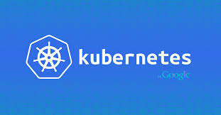

# nIkOs dOcKeR nOtEs
<br/>

---

## favourite docker cmd cheats

-

## alias
 - alias dl="docker ps -l -q" -> last container id
 - alias d="docker"
 - alias drm="docker rm"
 - alias dps="docker ps"
 - alias dpsas="docker ps -as"
 - alias dkd="docker run -d -P"
 - alias dockercleani='printf "\n>>> Deleting untagged images\n\n" && docker rmi $(docker images -q -f dangling=true)'

-

## bashcompletion
 - /etc/bash_completion.d/ (yum install ...)
 - wget [bash docker](https://raw.githubusercontent.com/docker/docker/master/contrib/completion/bash/docker)
-
## sublime syntax highlightning docker files
 - https://github.com/asbjornenge/Docker.tmbundle
-
## useful docker commands
 - remove all containers
  <pre><code> drm -f $(dps -aq) </code></pre> 
 - start a stopped container and attach to it
    <pre><code> function da () {  
    docker start $1 && docker attach $1 } </code></pre> 
 - top der laufenden container
    <pre><code> docker stats $(docker ps -q) </code></pre> 
 - Kill all running containers
    <pre><code> docker kill $(docker ps -q)</code></pre> 
 - delete old containers
 <pre><code>docker ps -a | grep 'weeks ago' | awk '{print $1}' | xargs docker rm </code></pre>
 - delete danling images
 <pre><code>docker rmi $(docker images -q -f dangling=true)</code></pre>
 - https://github.com/chadoe/docker-cleanup-volumes
 
---
## container runs
 - reveal JS

```
docker run -d -p 8000:8000 -v
/Users/nikomahle/Dockerfiles/mySlides:/revealjs/md amouat/revealjs:latest
```

 - best simple UI: dockerui

```
docker run -d -p 9000:9000 --privileged -v /var/run/docker.sock:/var/run/docker.sock
dockerui/dockerui
```

---
### Registry

```
docker run -d -p 5000:5000 registry
docker run -p 8080:8080 -e REG1=http://localhost:5000/v1/ -d atcol/docker-registry-ui
docker tag jenkins:1.596.2-8u45 localhost:5000/jenkins:1.596.2-8u45
docker push localhost:5000/jenkins:1.596.2-8u45
```

---
### container images
---
### jenkins hacks
 - start jenkins master

```
docker run -p 5555:8080 -p 50000:50000 -d -v 
/Users/nikomahle/Dockerfiles/jenkins/jenkins-data:/var/jenkins_home nikom-jenkins:1.596.2-jdk7u79-1
```

 - get slave.jar
 
```
wget http://hostname.de:8080/jnlpJars/slave.jar 
```
 - connect to jenkins master after manual adding of new node in jenkins master gui

```
wget http://hostname.de:8080/jnlpJars/slave.jar
```
 
---
### cool Dockerfiles
 - otechlabs in Dockerhub
 - devopsil in Dockerhub

-
## useful DockerFile cmd

```
RUN rm /etc/localtime && ln -s /usr/share/zoneinfo/Europe/Berlin /etc/localtime
```

---
### Docker stuff 
 - tools
 - plugins
 - gr8 container

-
## gliderlabs/logspout
 - greift per docker event / socket die Log STDOUT und STDERR der Docker Container ab.
 - start logspout

```
docker run -d --name="logspout" --volume=/var/run/docker.sock:
/tmp/docker.sock --publish=127.0.0.1:8000:80 gliderlabs/logspout 
```

 - curl the logs

``` 
curl http://172.17.0.108:8000/logs
curl http://172.17.0.108:8000/logs/id:containerid
curl http://172.17.0.108:8000/logs/name:containername
```

-
## consul
 - highly distributed and highly available tool for service discovery
 - http://jlordiales.me/2015/01/23/docker-consul/

```
docker run -d -p 8400:8400 -p 8500:8500 -p 8600:53/udp -h node1 
progrium/consul -server -bootstrap -ui-dir /ui
```

```
JOIN_IP="$(docker inspect -f '{{.NetworkSettings.IPAddress}}' node1)"
```

```
docker run -d --name node2 -h node2 progrium/consul -server -join 
$JOIN_IP
```

```
docker run -d --name node3 -h node3 progrium/consul -server -join 
$JOIN_IP
```

```
 curl -s http://10.xx.xx.20:8500/v1/catalog/services
 curl -s http://10.xx.xx.20:8500/v1/catalog/service/dockerui
```

-
## gliderlabs/registrator
 - http://gliderlabs.com/blog
 - http://jlordiales.me/2015/02/03/registrator
 - autom. Registrierung von Docker Containern 

```  
docker run -d -v /var/run/docker.sock:/tmp/docker.sock -h 
  $HOSTNAME gliderlabs/registrator consul://10.xx.xx.20:8500
```

-
## Lorry.io 
 - online docker-compose editor
 - validator
 - composer
 - https://lorry.io 

-
## DRAY
 - Docker Workflow Engine
 - http://dray.it

-
## ImageLayers
 - visualize docker images and layers
 - discover which layer is shared by multiple images
 - https://imagelayers.io/

-
## ZODIAC
 - built on top of docker-compose
 - Historisierung und Versionierung von deployments 
 - rollback of container versions
 - https://github.com/CenturyLinkLabs/zodiac/blob/master/README.md

-
## watchtower
 - https://github.com/CenturyLinkLabs/watchtower/blob/master/README.md
 - docker pull centurylink/watchtower

-
## prometheus
 - open-source systems monitoring and alerting toolkit
 - https://entropia.de/GPN15:Monitoring_mit_Prometheus
 - https://labs.ctl.io/monitoring-docker-services-with-prometheus/

-
## rancher convoy
 - docker plugin to backup and restore container (convoy) volumes
 - https://github.com/rancher/convoy#quick-start-guide
 - http://rancher.com/introducing-convoy-a-docker-volume-driver-for-backup-and-recovery

-
## rancher os
 - 20 mb linux distribution
 - gesamte os läuft in docker containern
 - an os made of containers

---
### Docker Management Frameworks
 - kubernetes
 - kitematic
 - panamax
 - rancher server

-
## kubernetes
  
 - opensource cluster management software von google
 - scheduler for docker containers
 - pods, labels, replication controllers
 - scaling, load balancing, health checking
 - google cloud or selfhosting
 - http://www.infoq.com/articles/scaling-docker-with-kubernetes

-
## kitematic
 - opensource gui management for docker containers
 - pretty easy and pretty cool
 - docker hub integration
 - inluded virtualbox image
 - only running on mac and windows
 - included in docker toolbox

-
## panamax 
 - complex multi container management
 - runs in virtualbox (coreos) with vagrant and homebrew 
 - templates (combination of containers)
 - sharing templates
 - stitching containers together
 - fleetctl 
 - https://www.youtube.com/watch?v=J0XWLiIu41Y 

-
## rancher container infrastructure platform
 - framework provides private container services and environments
 - provides tools and UI, container graphs	
 - powerful container management platform
 - resource management, health checking, recovery, service discovery, load balancing...
 - https://github.com/rancher/rancher#launching-management-server

```
docker run -d --restart=always -p 8080:8080 rancher/server
```


---
## PAAS in docker world

-
## dokku (dockerizing simple mini heroku)
 - uses docker
 - uses buildstep (Heroku's open source buildpacks)
 - uses gitreceive
 - a git push starts building and starting a docker container
 - http://progrium.com/blog/2013/06/19/dokku-the-smallest-paas-implementation-youve-ever-seen

-
## deis
 - open source paas für selfhosting zwecke
 - stack: coreos + docker + heroku light workflow
 - deploy application mit git push (gitreceive)
 - includes Heroku buildpacks like dokku
 - http://deis.io/overview/

---
## famous companies / commiter groups

-
## CenturyLink 
 - panamax (drag and drop management)
 - Lorry.io (docker-compose.yml validator and composer)
 - DRAY (docker workflow engine)
 - ImageLayers (visualize docker images and containers)
 - ZODIAC (deployment and rollback of docker apps)
 - watchtower (autom. detecting and restarting new cont. with new image)

-
## Gliderlabs (Jeff Lindsay)
 - registrator
 - progrium
 - megalith
-
## Hashicorp
 - terraform
 - serf

-
## Rancher Labs
 - rancher server
 - rancher os

---
## Netflix stack microservices
 - Netflix Eureka 
 - Netflix Ribbon
 - Netflix Hystrix

-
## Netflix Eureka 
 - Service Discovery Server Netflix Eureka allows microservices to register themselves at runtime as they appear in the system landscape.

-
## Netflix Ribbon 
 - Dynamic Routing and Load Balancer Netflix Ribbon can be used by service consumers to lookup services at runtime. Ribbon uses the information available in Eureka to locate appropriate service instances. If more than one instance is found, Ribbon will apply load balancing to spread the requests over the available instances. Ribbon does not run as a separate service but instead as an embedded component in each service consumer.

-
## Netflix Hystrix 
 - Circuit breaker Netflix Hystrix provides circuit breaker capabilities to a service consumer. If a service doesn’t respond, Hystrix can redirect the call to an internal fallback method in the service consumer. If a service repeatedly fails to respond, Hystrix will open the circuit and fast fail (i.e. fallback method) on every subsequent call until the service is available again. To determine wether the service is available again Hystrix allow some requests to try out the service even if the circuit is open. Hystrix executes embedded within its service consumer.


---
## to research 
 - rhel 7 bzw. atomic host
 - hashicorp terraform
 - hashicorp serf
 - weave
 - mesos
 - shipyard
 - flocker
 - https://ngrok.com
 - ruxit
 - zuul
 - ribbon
 - eureka
 - hystrix
 - https://cloud.google.com/container-engine/
 - https://github.com/rarchk/docklock
 - https://github.com/docktor/docktor

---
<!-- .slide: data-background="#555555" -->
## A slide with a different background
---
